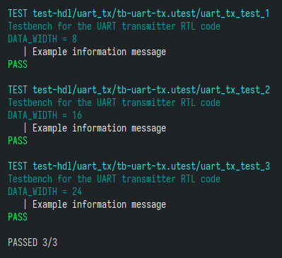

UTest
=====

UTest - приложение для одиночного или группового запуска и контроля выполнения тестбенчей на языке Verilog/SystemVerilog.
На данный момент реализована поддержка только [Icarus Verilog](http://iverilog.icarus.com/), но в дальнейшем
я планирую добавить поддержку [Verilator](https://www.veripool.org/verilator/) и [SymbiYosys](https://github.com/YosysHQ/sby).

Если вызвать приложение с параметром `--help`, она выведет текст справки с описанием параметров:
```
Usage: ./utest.scm [OPTION]... [FILE|PATH]
Run testbenches with recursive search in the PATH, or in the current folder
if PATH is not specified. If argument is a file, testbench is launched from FILE.

Options:
  -k, --keep           Do not delete work directory if test is pass.
  -d, --dump           Force dump waveforms.
  -r, --no-restart     Do not restart testbench with waveform dump enabled if
                       test failed (true by default)
  -n, --nocolor        Do not use color for print log
  -j, --jobs NUM       Use NUM threads for running testbenches. If <=0
                       use as many threads as there are processors in the system.
  -f, --defines        Print useful Verilog defines
  -c, --clean          Delete work folders that have a corresponding makefile.
      --force-clean    Delete all work folders regardless of the presence of a makefile.
  -v, --verbose        Verbose output
  -h, --help           Print this message and exit
```

Программа рекурсивно ищет все файлы с расширением `*.utest` и использует их в качестве сценариев запуска тестбенчей.
Если параметров указать файл, то будет использован он.

Сценарии запуска тестбенчей описываются на языке Scheme (а именно [Guile](https://www.gnu.org/software/guile/), на котором
и написана программа), и представляют из себя скрипт, который возвращает функцию (или список функций). Эта функция
(функции) будет вызвана в процессе запуска тестов, и в зависимости от результатов её выполнения тест будет помечен как
успешный или неуспешный. Функция вызывается в контексте приложения, по этому ёй доступны все переменные и функции,
объявленные в коде приложения.

Функция возвращает булево значение, и имеет один опциональный аргумент типа symbol.
Если функция вызвана без аргументов, она должна выполнить тестбенч и вернуть `#true` или `#false` в зависимости
от результата его выполнения. Если функции передается агрумент, то она должна вернуть некоторые метаданные в зависимости
от значения аргумента, или `#false` если таких метаданных нет. Сейчас использутся два типа метаданных - название теста
(агрумент `'name`) и описание теста (аргумент `'description`).

Для того, чтобы не писать вручную диспетчеризацию агрументов в приложении есть макрос `utest/tb`, который упрощает
описание сценариев:

```scheme
(utest/tb
 ("Name"
  "First line of testbench description"
  "Second line of testbench description")

 ;; testbench body
 )
```

После имени макроса в скобках указывается имя тестбенча и произвольное количество строк описания. Если аргументов нет,
тестбенч будет помечен как `noname`.

После скобочек с именем и описанием следует тело тестбенча. Тело - это любой валидный код на Guile, который будет выполнен
в процессе запуска тестбенчей. Результат работы этого кода должно быть булево значение, показывающее успешность выполнения
теста. Весь вывод в `stdout` будет перехвачен и отфильтрован в соответствии со значением флага `--verbose` и типом
выводимого текста.

Для типизации вывода можно использовать функцию `utest/log`. Первый параметр функции - тип выводимого
текста (опциональный), второй - строка формата как в функции `format`. Возможны три варианта значения типа: `'info`,
`'warning` и `'error`. Сообщения всех трёх типов будет выведено на экран вне зависимости от флага `--verbose`, но если
тип не указать, сообщение будет выведено только в режиме `--verbose`. Независимо от типа сообщения и флага `--verbose` все
сообщения будут сохранены в логе в рабочей папке теста.

Запуск симуляции в Icarus Verilog выполняется с помощью функции `utest/run-simulation-iverilog`. Функция принимает два
обязательных параметра и несколько опциональных:

```scheme
(utest/run-simulation-iverilog
   sources                              ; List of source files
   top                                  ; Name of the top module

   #:iverilog-executable "iverilog"     ; Icarus Verilog compiler executable path
   #:vvp-executable      "vvp"          ; Icarus Verilog simularot executable path
   #:modpaths            '()            ; iverilog -y
   #:modtypes            '(".v" ".sv")  ; iverilog -Y
   #:includes            '()            ; ivetilog -I
   #:lang                "2012"         ; Language version (1995, 2001, 2005, 2005-sv, 2009, 2012)
   #:parameters          '()            ; Top module parameters (list (list NAME VALUE))
   #:defines             '()            ; Preprocessor defines (list NAME|(list NAME VALUE))
   #:features            '()            ; iverilog -g
   #:separate            #f             ; iverilog -u
   #:plusargs            '()            ; List of plusargs
   #:vpimods             '()            ; iverilog -m, vvp -m
   #:vpipaths            '()            ; iverilog -L, vvp -M
   #:warnings            "all"          ; List of warning classes (iverilog -W...)
   #:dumpformat          'fst           ; Format of dump files. Posibly values: vcd, lxt, lxt2, fst
   #:timeout             '(1 ms)        ; Testbench execution timeout (in simulation time)
   )

```

*Все агрументы, кроме `parameters` и `defines`, которые принимают список, так же могут принимать и одиночные значения.*

Функция возвращает `#true` в случае успешного завершения теста, и `#false` в случае ошибки. Далее приведен пример использования:

```scheme
(map
 (lambda (n data-width)
   (utest/tb
    ((format "uart_tx_test~a" n)
     "Testbench for the UART transmitter RTL code"
     (format "DATA_WIDTH = ~a" data-width))

    (utest/log 'info "Example information message")

    ;; Start simulation
    (utest/run-simulation-iverilog
     '("uart_tx.sv" "uart_tx_tb.sv")
     "uart_tx_tb"
     #:includes   "."
     #:parameters `((DATA_WIDTH ,data-width))
     #:defines    '(TESTBENCH)
     #:timeout    '(5 ms))))
 '(1 2 3)
 '(8 16 24))
```

Сценарий возвращает три теста с разным значением параметра DATA_WIDTH. В случае успешного выполнения на экран будет выведен
следующий текст:



В случае неудачного завершения теста тест перезапускается с дампом всех сигналов в файл (это поведение можно отключить
опцией `--no-restart`). Кроме того, в случае ошибки будет выведен полный лог симулятора и его параметры.

Опция `--defines` выводит на экран исходник include-файла с макросами вывода информационных сообщений в тестбенче на Verilog:

```verilog
`ifndef UTEST_VERILOG_DEFINES
 `define UTEST_VERILOG_DEFINES

// Log level string prefixes for use with $display function.
// Example usage: $display("%sError message", `LOG_ERR);
 `define LOG_INFO "INFO#"
 `define LOG_WARN "WARN#"
 `define LOG_ERR  "FAIL#"

// Dirty hacked redefine of $display function. Must be used with two parentheses.
// Example usage: `log_info(("Information message"));
 `define log_info(msg)  begin $display({`LOG_INFO, $sformatf msg}); end
 `define log_warn(msg)  begin $display({`LOG_WARN, $sformatf msg}); end
 `define log_error(msg) begin $display({`LOG_ERR, $sformatf msg}); end
`endif
```

С помощью макроса `log_error` можно сообщить в UTest, что во время симуляции произошла ошибка. К сожалению,
в Icarus Verilog это пока единственная возможность сообщить об ошибке в тесте, т.к. при вызове функций `$error`
и `$fatal` симулятор возвращает нулевой exit code. В следующей версии авторы обещают исправить это досадное
недоразумение.
